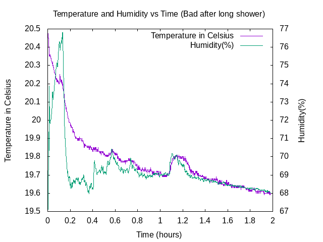
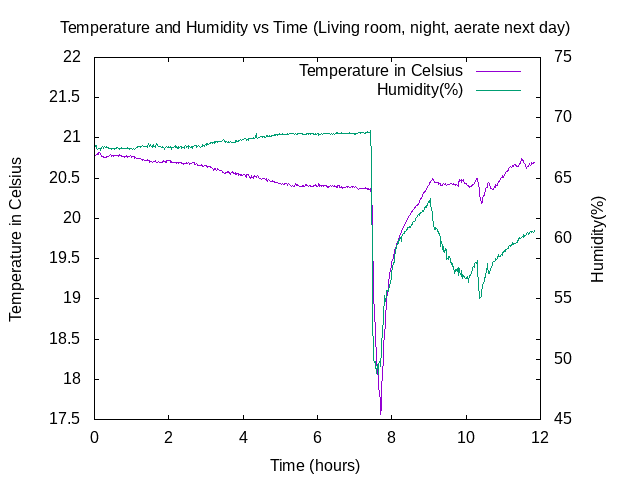
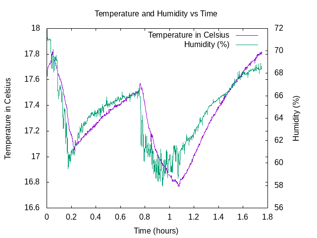
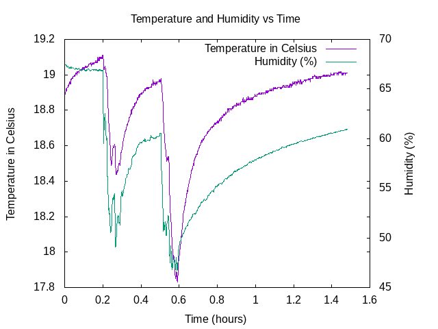

# Using the BME280 sensor for Temperature and Humidity measurements

## Compile and run

Install the bcm2835 library first and ensure that your system is handling
i2c bus communication correctly. Compile the source file with 'make' and
run the sensor reading program by typing './bme280_01'.
The program will print the temperature and humidity values to standard
output and also collect the results in the file "results.txt"

## Results

Here is a measurement example:

The fan was running continuously but the humidity remains high in this
small bathroom with no window. Nothing happened in the bathroom apart from
my son going to brush his teeth during the measurement, using water
from the tap for a very short time, this being the only way to
justify the peak that can be seen in the middle and telling a lot about
the sensor responsivity.

The following picture enhances the night/day difference. The windows were
opened in the morning of a sunny day in March.

The following pictures show the high average humidity despite aeration in two
different rooms in my flat.

