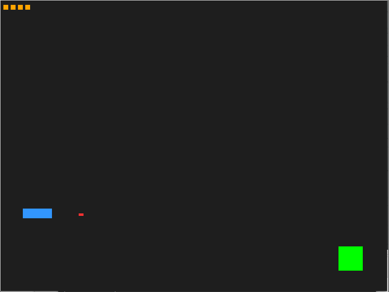

# A simple SDL game



## Try it out

Make sure that you have the SDL2 installed.
Compile the source with 'make' and run it by typing './hitTheTarget'.
If your computer has no X11 environment like my raspberry pi 4, make sure
that you are running on the local TTY or connected monitor, not just over
ssh. Then you can just run the program this way:

```
SDL_VIDEODRIVER=kmsdrm ./hitTheTarget
```

This is just a very easy program showing the basic library usage. Adapt
and modify the code as you like.
