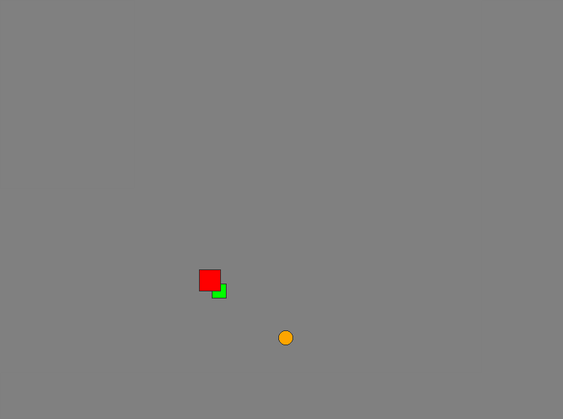

# A simple Qt game



## Try it out

Make sure the Qt5 installed and you have a C++17 compatible compiler.
or higher. To compile the code run the following:

```
mkdir build
cd build
cmake ..
make
```

## Run

```
./takeCareOrange
```

Alternatively, if your system has no X11 environment (for example a
Raspberry Pi running without a desktop), run the program using EGLFS:

```
./takeCareOrange -platform eglfs
```

Make sure you run it from the local TTY or connected monitor, not only over
ssh.

This is a minimal example demonstrating basic Qt usage. Feel free to
modify and extend the code.
