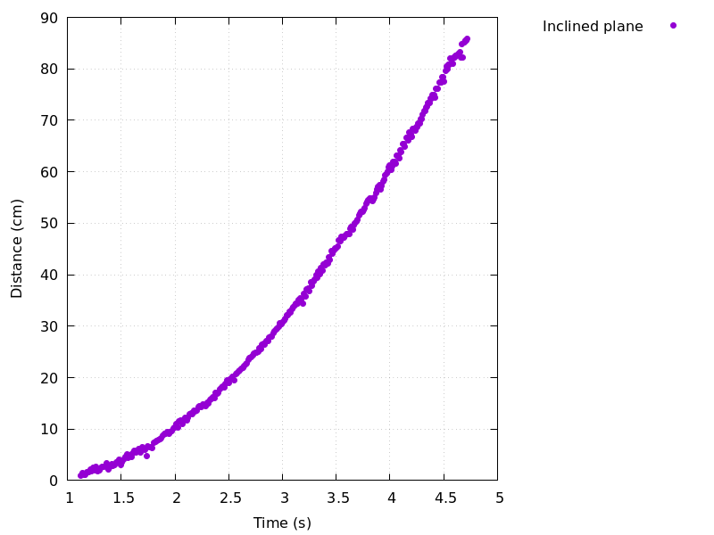
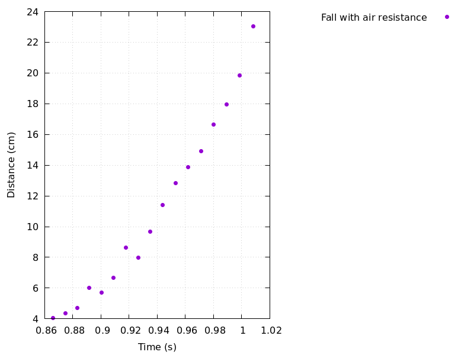

# Using the HC-SR04 sensor to create motion diagrams

## Results

My first experiment with the HC-SR04 sensor was to create some simple
motion diagrams.

The diagram shows that very good results could be obtained for motion
on an inclined table.

The fall experiments have been less succesfull as expected.
The ultrasonic sensor must send a signal and wait for the echo
while falling, so if the object position changes too quickly, the measurements
become very inaccurate.

Thus, the only very first part of the data shown in the following diagram
is quite reliable due to the short time scale.

