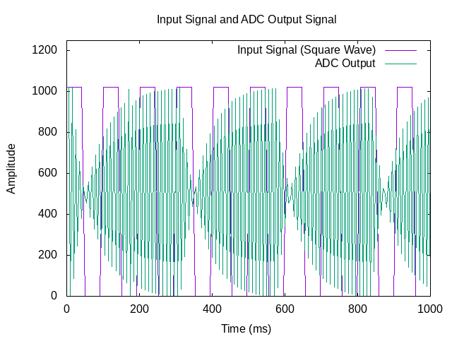
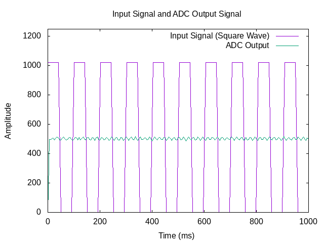

# RC Low-Pass Filter Signal Generation and Analysis

This project demonstrates how to use a Raspberry Pi to generate square wave signals and analyze the behavior of a low-pass filter (RC circuit) with different frequencies. The main objective is to observe the smoothing effect of the RC filter on the input square wave at various frequencies and visualize the results.

## Overview

The project uses the Raspberry Pi's GPIO pins, an MCP3008 ADC, and a low-pass filter circuit consisting of a resistor (R) and a capacitor (C). The square wave signal is generated by the Raspberry Pi, and the filtered output is read through the MCP3008. The results are plotted using **gnuplot** to visualize the filtering effect.

### Key Components:
- **Raspberry Pi (GPIO pins)**: Used for generating square wave signals and reading ADC values.
- **MCP3008**: An 8-channel ADC used to read the filtered signal.
- **Resistor (R)**: 10kΩ.
- **Capacitor (C)**: 100nF.
- **Low-pass RC filter**: Designed to smooth the input square wave signal.

## Setup Instructions

### Hardware Connections

1. **RC Circuit**:
   - Connect the **10kΩ resistor** in series with the **100nF capacitor**.
   - Connect one end of the resistor to **GPIO37 (BCM GPIO26)** and the other end to both the **MCP3008 channel 2 (pin 3)** and the **capacitor**.
   - Connect the other end of the **capacitor** to the **ground (GPIO39)**.
   - Make sure the **MCP3008** is correctly connected to the Raspberry Pi SPI pins (CE0, MOSI, MISO, and SCK).

2. **Raspberry Pi GPIO**:
   - Set **GPIO37 (BCM GPIO26)** as the output for the square wave.
   - Set **GPIO39** to ground.
   - Use the **MCP3008** for ADC readings on **Channel 2**.

### Software Setup

1. **Install the bcm2835 library**:
   If you haven't already, install the `bcm2835` library to control the GPIO and SPI communication on the Raspberry Pi:
   ```
   sudo apt-get install libbcm2835-dev
   ```

2. **Compile and Run the Program**:

The program to generate a square wave signal and read ADC values.
Compile the program:

```
gcc -o rc_signal rc_signal.c -lbcm2835
```

Run the program:

```
sudo ./rc01
```

## Results

### Expected Behavior of the Low-Pass Filter

- The square wave generated by the Raspberry Pi will be filtered by the RC circuit.

- The low-pass filter should smooth the sharp transitions of the square wave, converting it into a more rounded signal.

- At higher frequencies, you will notice that the smoothing effect is more significant, and the output signal's amplitude will decrease as the frequency increases.

- This behavior is due to the RC filter's frequency response, which gradually attenuates higher frequencies.

### Frequency Response

The RC filter has a cutoff frequency, which depends on the resistor and capacitor values:

fcutoff=12πRC
f
cutoff
	​

=
2πRC
1
	​


For R = 10kΩ and C = 100nF, the cutoff frequency is approximately 159 Hz.

Below this cutoff frequency, the signal passes through with little attenuation. However, above the cutoff frequency, the signal is attenuated, and the smoothing effect becomes more apparent.

### Signal Decrease

As the frequency of the input signal increases (e.g., from 1 kHz to 10 kHz), the filtered signal's peak amplitude will decrease due to the frequency-dependent behavior of the low-pass filter.

At higher frequencies, the capacitor charges and discharges more quickly, resulting in a lower output signal.

### Example Output

Sample output from the ADC readings:

```
ADC Value (Channel 2): 1023
ADC Value (Channel 2): 423
ADC Value (Channel 2): 483
ADC Value (Channel 2): 531
ADC Value (Channel 2): 572
...
```

### Graphical Representation

The results can be visualized by plotting the filtered signal and comparing it with the input signal (square wave). Use gnuplot to plot the ADC readings and the theoretical square wave signal over time. This will allow you to visually confirm the smoothing effect of the RC filter.

 

In this diagram, we observe the output signal of the low-pass filter at 100 Hz, which is near the cutoff frequency of the filter (approximately 159 Hz). At this frequency, the signal is not completely filtered out but instead undergoes attenuation, causing it to become intermittent and modulated.

The "signal balls" (or bursts) you see represent the periodic peaks of the input signal that still manage to pass through the filter, albeit with reduced amplitude. This is a characteristic behavior of the low-pass filter as it struggles to pass the signal near its cutoff point. The periodicity of these bursts corresponds to the fundamental frequency of the input signal (10 Hz), while the low-pass filter progressively smooths and attenuates higher-frequency components.

This behavior is expected when signals are passed through filters near the cutoff frequency, demonstrating the filter's frequency response and attenuation characteristics.

 

The diagram above shows a low frequency signal(10Hz), while the two following
diagrams show the behaviour of a 1kHz and 10kHz signals.

 

 

## Conclusion

This project provides hands-on experience with signal processing and filtering using a Raspberry Pi and simple electronic components. By adjusting the frequency of the input signal, you can observe how the RC low-pass filter smooths the signal, with the output becoming more attenuated as the frequency increases.

### Experimentation

Feel free to experiment with different resistor and capacitor values to observe how the cutoff frequency changes and affects the output. You can also vary the input square wave frequency to see the filtering effects at different frequencies.
