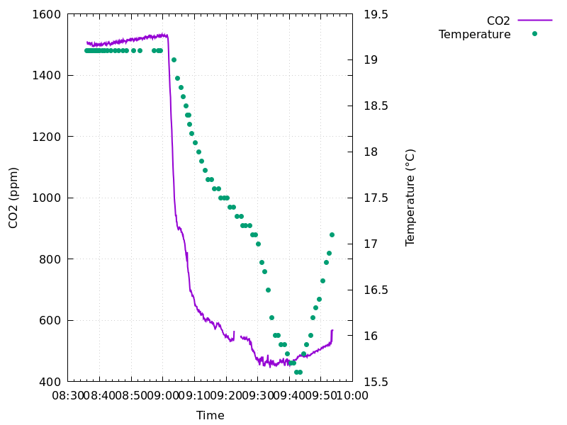

# Using the MH-Z19c sensor to measure the CO2 in my town district

## The circuit


The wiring is quite straightforward: the sensor should be powered
from a 5V power pin and connected to ground.
The Raspberry Pi UART0 TX and UART-RX-pins
should be connected to the RX and TX pins of the sensor, respectively.
Since this was my first experience with a mobile power bank, I wanted
to make sure that the program would consume as few resources as possible.
For this reason I added a button connected to a GPIO-PIN of the Raspberry Pi.
When the button is pressed, the LED shows that the communication is working
by turning on for one second. After that, a measurement cycle lasting twenty
seconds is started. During this time, about 10 CO2 values are collected.
The measurement results are collected in the file "room_co2.txt".

## Experimental details


The picture above shows the experimental apparatus that I carried with me
while walking through my town district:

- A 10000mAh power bank

- The board with the starting button and the LED 

- My Raspberry Pi 4

- The MH-Z19c sensor

There were some conflicts in the GPIO communication that caused
the program to stop communicating with the sensor and simply hang.
I tried to understand for this behaviour, but without success.
This is why you will find many debugging print statements in
the code. If you experience the same problem, you may find these
useful.

Please note that the MH-Z19C sensor requires a warm-up period in order
to perform its automatic calibration. During this warm-up period the
measured values may fluctuate significantly.
This period can be quite long,
depending on how long the sensor has been switched off.

After this period the sensor produces very stable and reliable
results as you can tell from the following picture:



The diagram shows the CO2 concentration as a function of time in a small
room in which I slept, emitting approximately 20 liters of CO2 per hour.
The temperature at the sensor location remained constant for several minutes.
I then began opening windows in the rest of the apartment (but not in the
small room itself). This ventilation led to a gradual decrease in
temperature at the sensor location, along with a simultaneous decrease
in CO2 concentration. After 30 Minutes I also opened the window in the small
room as well. The window remained open for 10 minutes. After this period,
all windows were closed and normal heating resumed.

## Use the program yourself

If you only want to measure the CO2 concentration with the MH-Z19C-sensor
you should just clone the repository, check or adjust the wiring pins and
then give the command

```
make co2
```
in the current directory.

Note that the command "make" would fail if you don't have the
library "bcm2835" installed, because the version of the program that
uses GPIO Button control (which was mainly used for this project)
will not be compiled.
To run the program, simply type
```
./co2
```
or
```
./co2b
```
if you want the extended version.
You should see something like this:

```
1. c(CO2): 577 ppm 2026-03-17 09:59:47
2. c(CO2): 578 ppm 2026-03-17 09:59:53
3. c(CO2): 576 ppm 2026-03-17 09:59:59
4. c(CO2): 577 ppm 2026-03-17 10:00:05
5. c(CO2): 574 ppm 2026-03-17 10:00:11
6. c(CO2): 575 ppm 2026-03-17 10:00:17
```

or (if bcm2835 is installed and co2b version was compiled successfully),
the program will print to standard output its reaction to the button
press and will generate the file "results.txt".
The result file looks like this:

```
Messung Nr. 1: 2026-03-15 08:57:23
 5781  58670  484  485  483  482  477  480  482  482 

Messung Nr. 2: 2026-03-15 08:58:18
 480  474  468  480  480  484  483  481  482  484 

Messung Nr. 3: 2026-03-15 08:59:49
 483  488  486  487  482  486  478  479  477  476 

```

[Results](./results/README.md)
