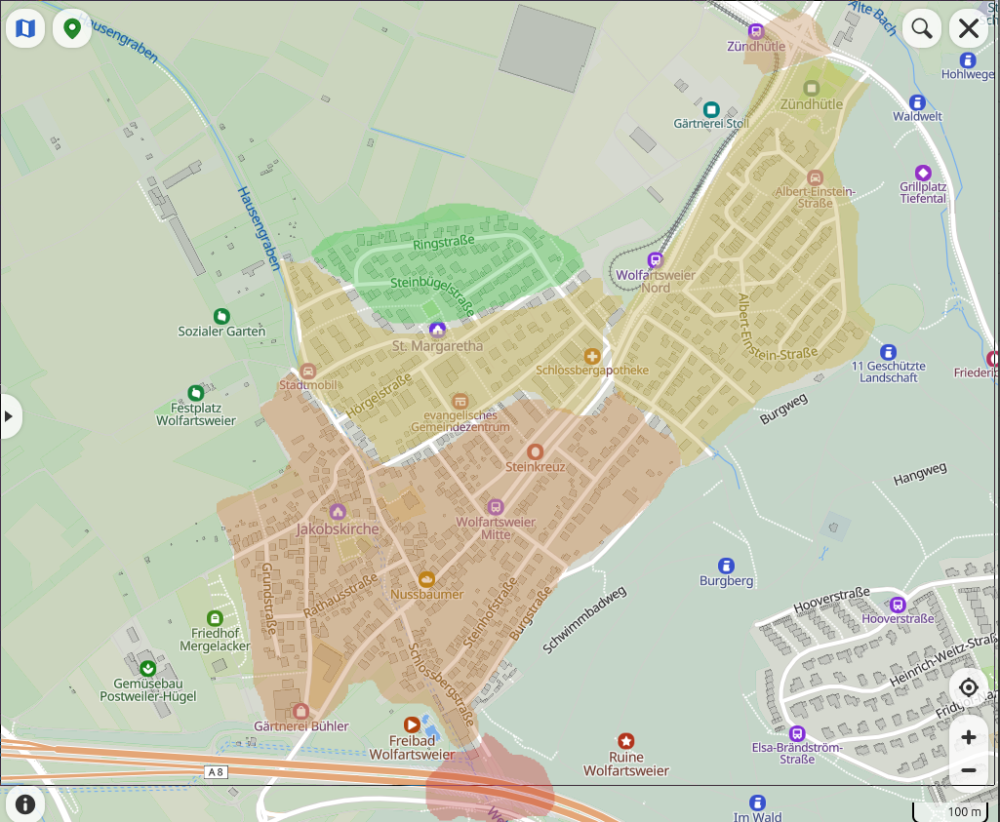

# Results

Estimated CO2 concentration in ppm:

red: over 500

orange: around 480/490

yellow: around 460/470

green: below 440

## How to read this

First of all, you should note that this work is a low-cost
project carried out in my free time, with the main aim of improving
my understanding of hardware management in electronics, rather than
presenting valuable scientific results.

The map shows Wolfartsweier (76228-Karlsruhe, Germany) divided
in different reagions depending on the estimated CO2 concentration.

I dedicated only one day to the measuerements. It was a dry, cloudy
and cold day in March.

The detailed results can be found in the files "morning.txt" and
"afternoon.txt". At each measurement location I pressed the
GPIO-connected button three times. Each time the program ran for
20 seconds, collecting about 10 CO2-Values.

I also stored humidity, temperature and other weather data from wetter.de.
Despite this information being here available,
I currently have no clear method for incorporating these factors into
the analysis.
Developing formulas that properly account for these variables would
clearly go beyond the scope of this project.

Regarding the results, it is
not surprising that the part of the distict located
near the A8 Highway shows higher CO2 concentrations.

Near the narrow cross street, the CO2 concentration is
also higher than elsewhere, which is expected. In addition, air quality
consistently improves when the density of buildings decreases.

The effect of the nearby woods seems noticeable. There is a clear
drop in CO2 concentration when moving from Schlossbergstrasse
toward Burgstrasse.

To better understand this effect, further experiments should include
comparison between daytime and nighttime measurements.

In conclusion, even if the results are not particularly spectacular,
longer measurement periods and
comparison with different weather conditions or seasons could turn
this small project into something that might even be of interest to
local authorities.

