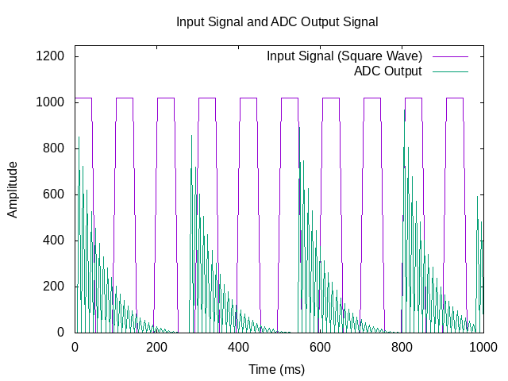
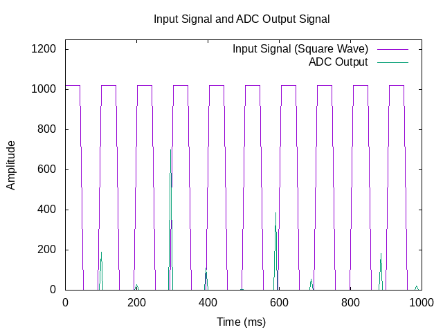
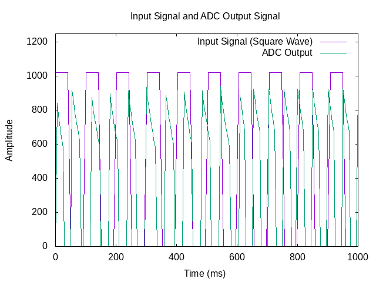
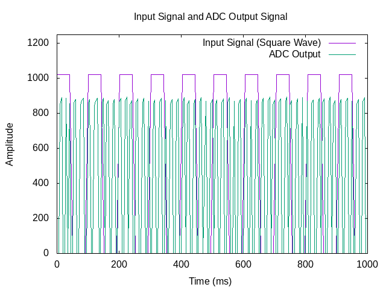

## High-Pass Filter Results

### Expected Behavior of the High-Pass Filter

- The square wave generated by the Raspberry Pi will be filtered by the RC circuit.

- The high-pass filter should preserve the sharp transitions of the square
  wave, removing the lower-frequency components and allowing the
  higher-frequency components to pass through, resulting in a more pronounced,
  spiky signal.

### Frequency Response

The RC filter has a cutoff frequency, which depends on the resistor and
capacitor values:

```
fcutoff=1/(2πRC)
```

For R = 10kΩ and C = 100nF, the cutoff frequency is approximately 159 Hz.

Below this cutoff frequency, the low-frequency components of the signal
(like the flat parts of a square wave) are increasingly attenuated, while
the higher-frequency components pass through with less attenuation.
Above the cutoff frequency, the high-frequency components pass through
more easily, and the sharp transitions of the square wave become more
pronounced, with less smoothing effect.

### Signal Behavior

Diagram 1: 100 Hz (Moderate Frequency, near cutoff)

 

At 100 Hz, the output shows 4 peaks with decreasing spacing between them,
occurring within the 0 to 1-second range. This behavior suggests that the
high-pass filter is starting to pass higher frequencies while attenuating
lower frequencies. The peaks appear due to the retention of some
higher-frequency components of the square wave, but the output is no longer
a perfect square wave. The decreasing band structure indicates the attenuation
of the low-frequency parts of the square wave.

Diagram 2: 10 Hz (Low Frequency)

 

At 10 Hz, the filtered signal shows almost no signal after filtering.
This is because low-frequency components (like the 10 Hz signal) are
attenuated by the high-pass filter. The filter allows high frequencies
to pass through, but at such low frequencies, most of the signal is removed,
resulting in a very weak or near-zero output.

Diagram 3: 1000 Hz (Higher Frequency)

 

At 1000 Hz, the filtered signal begins to take on a trapezoidal structure,
with more peaks than the original square wave. The higher-frequency
components are allowed to pass through with minimal attenuation, and the
signal becomes more jagged. The sharp transitions of the square wave are
now clearer, but the signal is distorted into a trapezoid as the high-pass
filter continues to remove the low-frequency parts of the wave.

Diagram 4: 10000 Hz (Very High Frequency)

 

At 10000 Hz, the signal shows even more peaks than at 1000 Hz, and the
amplitude of the peaks is higher. The high-pass filter is allowing the
higher-frequency components to pass through with almost no attenuation.
As a result, the signal becomes more complex with many more oscillations,
and the peaks are more pronounced, indicating that the high-frequency
content is being passed through while the low-frequency parts are filtered out.
