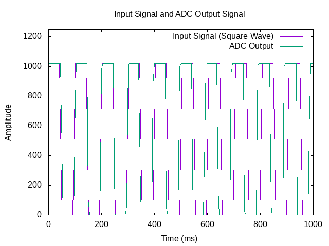
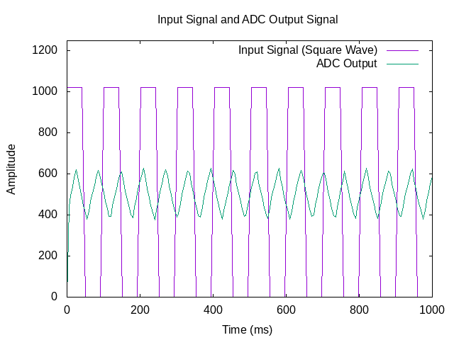

## Low-Pass Filter Results

### Expected Behavior of the Low-Pass Filter

- The square wave generated by the Raspberry Pi will be filtered by the
  RC circuit.

- The low-pass filter should smooth the sharp transitions of the square wave,
  converting it into a more rounded signal.

- At higher frequencies, you will notice that the smoothing effect is more
  significant, and the output signal's amplitude will decrease as the frequency
  increases.

- This behavior is due to the RC filter's frequency response, which gradually
  attenuates higher frequencies.

### Frequency Response

The RC filter has a cutoff frequency, which depends on the resistor and
capacitor values:

```
fcutoff=1/(2πRC)
```

For R = 10kΩ and C = 100nF, the cutoff frequency is approximately 159 Hz.

Below this cutoff frequency, the signal passes through with little attenuation.
However, above the cutoff frequency, the signal is attenuated, and the
smoothing effect becomes more apparent.

### Signal Behavior

As the frequency of the input signal increases (e.g., from 1 kHz to 10 kHz),
the filtered signal's peak amplitude will decrease due to the
frequency-dependent behavior of the low-pass filter.

At higher frequencies, the capacitor charges and discharges more quickly,
resulting in a lower output signal.

 

In this diagram, we observe the output signal of the low-pass filter at 100 Hz,
which is near the cutoff frequency of the filter (approximately 159 Hz).
At this frequency, the signal is not completely filtered out but instead
undergoes attenuation, causing it to become intermittent and modulated.

The "signal balls" (or bursts) you see represent the periodic peaks of the
input signal that still manage to pass through the filter, but with reduced
amplitude. This is a characteristic behavior of the low-pass filter as it
struggles to pass the signal near its cutoff point. The periodicity of these
bursts corresponds to the fundamental frequency of the input signal (10 Hz),
while the low-pass filter progressively smooths and attenuates higher-frequency
components.

This behavior is expected when signals are passed through filters near the
cutoff frequency, demonstrating the filter's frequency response and
attenuation characteristics.

 

The diagram above shows a low frequency signal(10Hz), while the two following
diagrams show the behaviour of a 1kHz and 10kHz signals.

 

 
